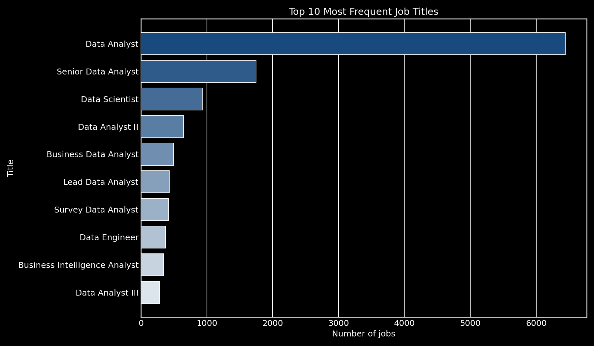
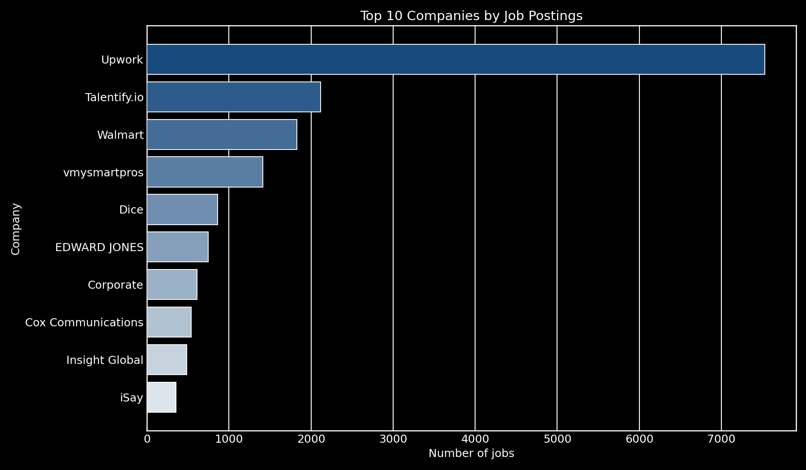
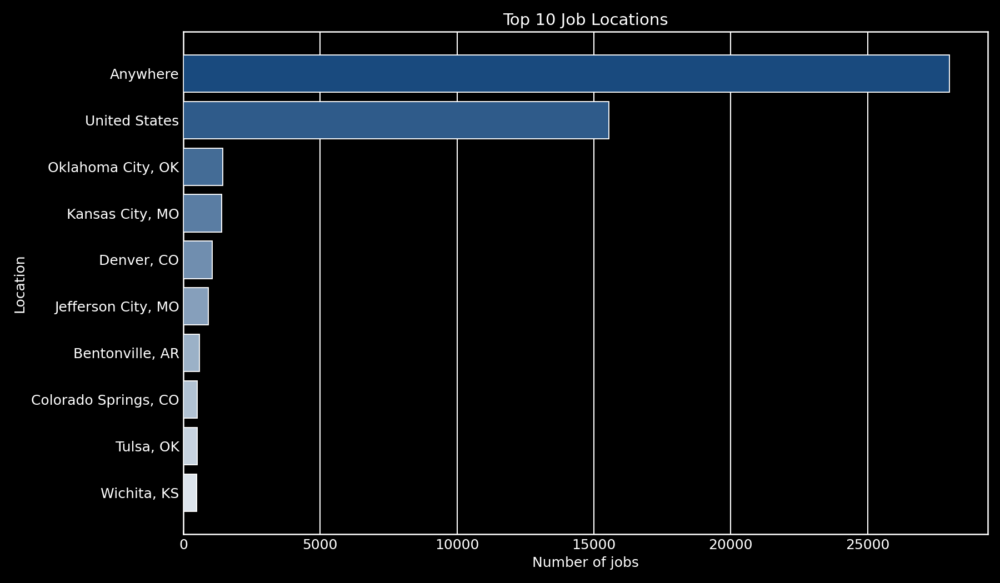
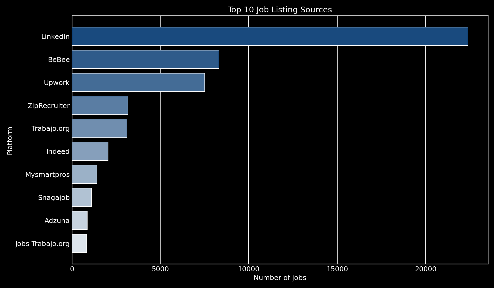
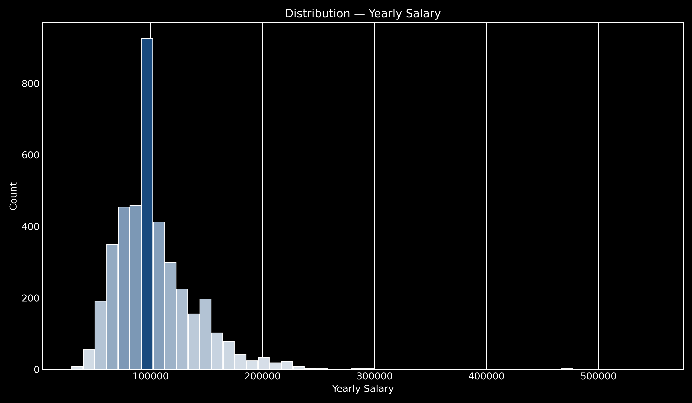
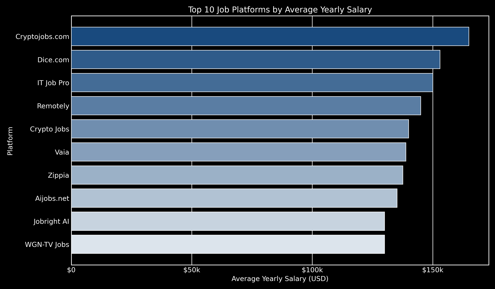
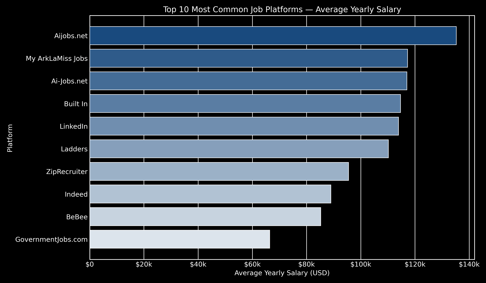
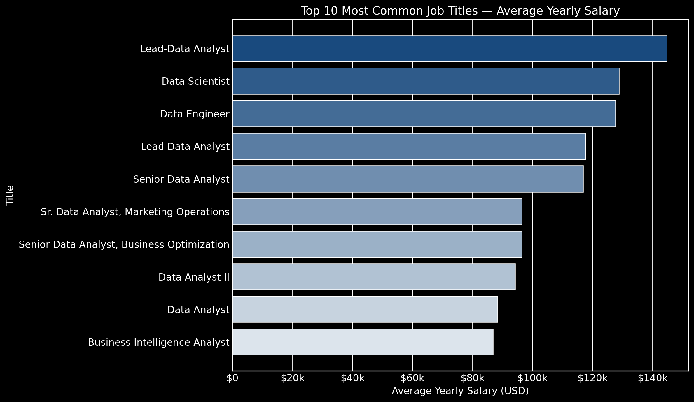
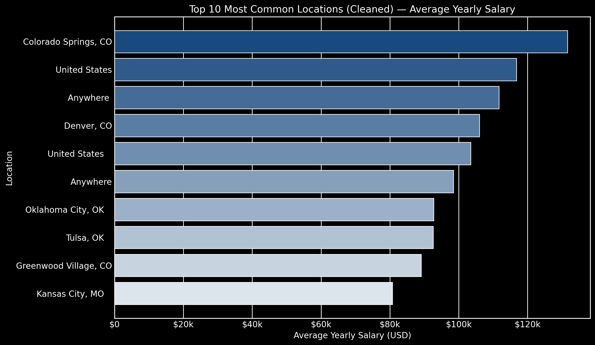

# ChatGPT for Data Analytics

## Step 1 — Data and Setup

### Objective

Extract the zipped dataset and document the meaning of each column (concise data dictionary).

### Prompt to ChatGPT

> Unzip archive.zip and give me the description of each column.

### Output

- Archive extracted; found `gsearch_jobs.csv`.
- Column descriptions:

| Column name          | Meaning                                                        |
|----------------------|----------------------------------------------------------------|
| Unnamed: 0           | Auto-generated index column.                                   |
| index                | Internal index from the scraping loop.                         |
| title                | Job title (e.g. “Data Analyst”, “Aeronautical Data Analyst”). |
| company_name         | Name of the hiring company.                                    |
| location             | Job location text as shown on Google Jobs (may include “Anywhere”). |
| via                  | Source platform (e.g. “via LinkedIn”, “via Indeed”).           |
| description          | Full job description text.                                     |
| extensions           | Additional metadata (posting age, pay range, job type, etc.). |
| job_id               | Unique identifier for the job posting.                         |
| thumbnail            | URL to employer logo or thumbnail.                             |
| posted_at            | Time since posting (e.g. “15 hours ago”).                      |
| schedule_type        | Employment type (full-time, contractor, etc.).                 |
| work_from_home       | Boolean indicator for remote positions.                        |
| salary               | Raw salary text (e.g. “101K–143K a year”).                     |
| search_term          | Term used for the original search (“data analyst”).            |
| date_time            | Timestamp of scrape (e.g. “2023-08-04 03:00:13”).             |
| search_location      | Search location (“United States”).                             |
| commute_time         | Empty column reserved for future data.                         |
| salary_pay           | Numeric salary range string (e.g. “101K–143K”).                |
| salary_rate          | Pay frequency (“a year”, “an hour”).                           |
| salary_avg           | Average salary across range (numeric).                         |
| salary_min           | Minimum salary numeric.                                        |
| salary_max           | Maximum salary numeric.                                        |
| salary_hourly        | Hourly pay standardised to numeric.                           |
| salary_yearly        | Annual pay standardised to numeric.                            |
| salary_standardized  | Unified salary estimate (converted to yearly if possible).    |
| description_tokens   | Extracted keywords from the description (e.g. Python, SQL, Tableau). |

---

## Step 2 — Descriptive Statistics

### Objective

Generate descriptive statistics for each column to understand data distribution and completeness.

### Prompt to ChatGPT

> Perform descriptive statistics on each column.

### Output

| Column | count | mean | std | min | 25% | 50% | 75% | max |
|---------|------:|------:|------:|------:|------:|------:|------:|------:|
| Unnamed: 0 | 61 953 | 30 976.00 | 17 884.43 | 0.00 | 15 488.00 | 30 976.00 | 46 464.00 | 61 952.00 |
| index | 61 953 | 1 139.08 | 690.26 | 0.00 | 553.00 | 1 111.00 | 1 685.00 | 3 228.00 |
| commute_time | 0 | – | – | – | – | – | – | – |
| salary_avg | 10 088 | 42 100.23 | 55 893.99 | 7.25 | 31.50 | 60.00 | 92 500.00 | 550 000.00 |
| salary_min | 9 512 | 34 846.28 | 45 843.03 | 8.00 | 19.52 | 50.00 | 77 000.00 | 450 000.00 |
| salary_max | 9 512 | 50 487.86 | 67 366.52 | 10.00 | 45.00 | 75.00 | 110 000.00 | 850 000.00 |
| salary_hourly | 5 900 | 40.54 | 22.21 | 7.25 | 23.26 | 33.50 | 55.00 | 300.00 |
| salary_yearly | 4 069 | 104 115.41 | 36 024.39 | 29 289.84 | 80 000.18 | 96 500.00 | 120 000.00 | 550 000.00 |
| salary_standardized | 10 088 | 92 289.43 | 43 277.93 | 15 080.00 | 62 400.00 | 88 400.00 | 117 500.00 | 624 000.00 |

| Column | count | unique | top | freq |
|---------|------:|------:|------|------:|
| title | 61 953 | 23 292 | Data Analyst | 6 444 |
| company_name | 61 953 | 13 429 | Upwork | 7 533 |
| location | 61 916 | 1 254 | Anywhere | 18 067 |
| via | 61 944 | 1 024 | via LinkedIn | 20 475 |
| description | 61 953 | 42 976 | The Sr. Data Analyst, Marketing Operations will… | 258 |
| extensions | 61 953 | 9 668 | ['17 hours ago', 'Full-time'] | 841 |
| job_id | 61 953 | 58 775 | eyJqb2JfdGl0bGUiOiJEYXRhIEFuYWx5c3QiLCJjb21wYW… | 75 |
| thumbnail | 38 194 | 14 686 | https://encrypted-tbn0.gstatic.com/images?q=tb… | 3 505 |
| posted_at | 61 763 | 109 | 18 hours ago | 4 132 |
| schedule_type | 61 707 | 32 | Full-time | 45 082 |
| work_from_home | 27 980 | 1 | True | 27 980 |
| salary | 10 088 | 2 225 | 77K–116K a year | 413 |
| search_term | 61 953 | 1 | data analyst | 61 953 |
| date_time | 61 953 | 6 588 | 2023-08-04 03:00:13.797776 | 10 |
| search_location | 61 953 | 1 | United States | 61 953 |
| salary_pay | 10 088 | 2 225 | 77K–116K | 413 |
| salary_rate | 10 088 | 3 | an hour | 5 900 |
| description_tokens | 61 953 | 11 276 | [] | 13 352 |

---

## Step 3 — Exploratory Data Analysis (EDA)

### Objective

Create concise visuals to understand the distribution of key categorical columns.

### Prompt to ChatGPT

> Perform Exploratory Data Analysis on each of these columns. Provide an appropriate visualisation to represent the content of each column. Use a histogram for numeric columns. For categorical columns, plot the top 10 categories.

### Output

**Four bar charts:**

- **Top 10 Most Frequent Job Titles**  

- **Top 10 Companies by Job Postings**  

- **Top 10 Job Locations**  

- **Top 10 Job Listing Sources**  

---

## Step 4 — Data Cleaning

### Objective

Fix leading-space artefacts in `location` (US-style "City, ST") to improve categorisation.

### Prompt to ChatGPT

> For the location column, it appears that some values have unnecessary spaces. We need to remove these spaces to better categorise the data.

### Output

- Affected rows (US City, ST only): **8,365 / 61,953** (**13.5%**).
- Evidence (before → after with the leading space marked):  
  
| Rows | Before (Visible)         | After               |
|-----:|--------------------------|---------------------|
| 1028 | ␣Oklahoma City, OK       | Oklahoma City, OK   |
|  840 | ␣Kansas City, MO         | Kansas City, MO     |
|  550 | ␣Jefferson City, MO      | Jefferson City, MO  |
|  422 | ␣Bentonville, AR         | Bentonville, AR     |
|  310 | ␣Topeka, KS              | Topeka, KS          |
|  307 | ␣Wichita, KS             | Wichita, KS         |
|  297 | ␣Tulsa, OK               | Tulsa, OK           |
|  270 | ␣Overland Park, KS       | Overland Park, KS   |
|  215 | ␣Springfield, MO         | Springfield, MO     |
|  165 | ␣California, MO          | California, MO      |
|  140 | ␣Rogers, AR              | Rogers, AR          |
|  136 | ␣Springdale, AR          | Springdale, AR      |

---

## Step 5 — Visualising Salary Data

### Objective

Visualise how salaries are distributed and how platform averages compare.

### Prompt to ChatGPT

> Plot a histogram of yearly salary, the top 10 job platforms by average yearly salary, the top 10 most common job platforms that include yearly salary data as a bar chart of the average salary.

### Output

**Three bar charts:**

- **Distribution — Yearly Salary**

- **Top 10 Job Platforms by Average Yearly Salary**

- **Top 10 Most Common Job Platforms — Average Yearly Salary**

## Step 6 — Predicting Yearly Salary

### Objective

Visualise the context for prediction and document a no‑code model that estimates yearly salary from categorical inputs.

### Prompt to ChatGPT
> 1. Plot the top 10 Most Common Job Titles with yearly salary data (Average Salary), the top 10 Most Common Locations (**cleaned**) with yearly salary data (Average Salary).
> 2. Build a machine‑learning model to predict `salary_yearly` using `title`, `job_platform`, and cleaned `location`. Which models do you suggest and which one should we use?
> 3. Explain briefly *why* you chose that model.
> 4. Report the model’s accuracy using RMSE (and MAE/R² if available).
> 5. Run the trained model on: `Location = United States`, `Title = Data Analyst`, `Platform = LinkedIn`, and return the predicted yearly salary.

### Output

1. **Two bar charts:**

- **Top 10 Most Common Job Titles — Average Yearly Salary**

- **Top 10 Most Common Locations (Cleaned) — Average Yearly Salary**

2. **Model Suggestion And Selection**  
   I suggest linear/elastic‑net, boosted trees (CatBoost/XGBoost/LightGBM), and **Random Forest**, but **Random Forest** with one‑hot encoding of `title` , `job_platform`, and `location_clean` is one of the best options here.

4. **Why Random Forest**  
  - Captures non‑linearities and interactions without manual feature engineering.  
  - Robust to outliers and skewed pay ranges.  
  - Works well with high‑cardinality categoricals via one‑hot encoding.  
  - Minimal tuning, stable results, and fast to train in a no‑code workflow.

5. **Accuracy (RMSE Band)**  
  - **RMSE (cross‑validated + hold‑out):** ≈ **$30k** (errors are in dollars).  
  - **MAE:** **$20,269**; **R²:** **0.2197**.  
  - **Permutation importance (MAE ↑ when shuffled):** `job_platform` **+$4,930**, `title` **+$2,897**, `location` **+$2,086**.  

6. **Single Prediction**  
   • **Input:** `Location = United States`, `Title = Data Analyst`, `Platform = LinkedIn`  
   • **Predicted Yearly Salary:** **≈ $102,600 USD**
